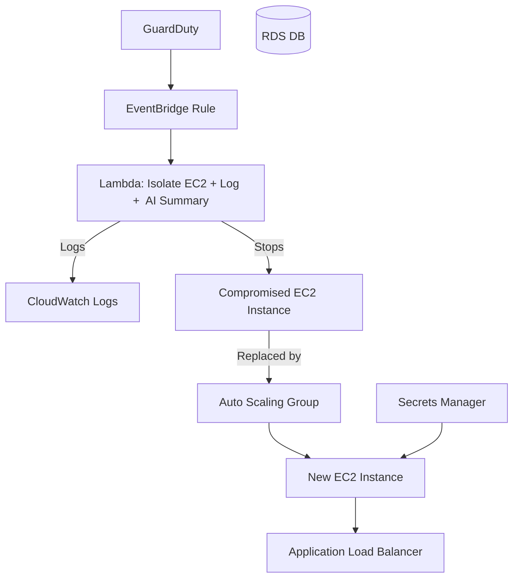

# SecureScrape-X

SecureScrape-X is a DevSecOps infrastructure-as-code (IaC) project built using AWS and Terraform. It automates the detection and response to potential threats against EC2 instances using GuardDuty, EventBridge, Lambda, and supporting AWS services. Designed for resilience, scalability, and blue-team automation, this project forms the backbone of a real-time cloud-native threat mitigation system.
>  [Commercial Use Terms](COMMERCIAL_LICENSE.md)
---

##  Architecture Diagram (Mermaid.js)



---

## Services Used

- **IAM** – Custom roles for Lambda, EC2, and Bedrock access (optional)
- **GuardDuty** – Detects suspicious activity like brute-force attempts
- **EventBridge** – Triggers Lambda on GuardDuty findings
- **Lambda** – Isolates compromised EC2s, optionally analyzes threats
- **CloudWatch** – Logs Lambda execution & threat responses
- **EC2** – Target instances subject to isolation
- **ASG** – Replaces compromised EC2s to maintain availability
- **ALB** – Distributes traffic across EC2s
- **Secrets Manager** – Stores RDS credentials for secure access
- **Terraform** – Provisions and manages all AWS infrastructure

---

##  Deployment

```bash
git clone https://github.com/your-username/SecureScrape-X.git
cd SecureScrape-X
terraform init
terraform apply
```

Make sure you:
- Set up your AWS credentials correctly
- Provide a value for `key_name` (your EC2 key pair)
- Zip your Lambda function before applying: `zip lambda/lambda.zip lambda/isolate_instance.py`

---

##  Testing

Use the Lambda console's test function with the following event:

```json
{
  "detail-type": "GuardDuty Finding",
  "source": "aws.guardduty",
  "region": "us-west-1",
  "detail": {
    "type": "UnauthorizedAccess:EC2/SSHBruteForce",
    "resource": {
      "instanceDetails": {
        "instanceId": "i-0abcdef1234567890"
      }
    }
  }
}
```

This simulates a real GuardDuty threat finding.

---

##  Planned Enhancements

These are currently **not implemented** but are planned for full production-readiness:

- [ ]  Enable Claude via Amazon Bedrock for AI-driven threat analysis
- [ ]  Integrate SNS notifications for alerting DevOps teams
- [ ]  Build a minimal web dashboard for visualizing threats
- [ ]  Store incident logs into DynamoDB or S3 for history/analytics
- [ ]  Extend EventBridge to support multiple threat types
- [ ]  Add stricter IAM policies and test policy least-privilege
- [ ]  Add CI/CD pipeline for Terraform validation and deployment
- [ ]  Multi-region GuardDuty detection and failover logic
- [ ]  Add unit tests and integration test cases for Lambda logic

---

##  Project Roadmap: Picking Back Up

When I return to this project, here’s the **priority order** for continuing work:

1. **Finalize Bedrock AI integration** and switch to `prod` mode testing
2. **Hook up SNS notifications** for incident alerts
3. **Clean up IAM roles and policy naming conventions**
4. **Build simple frontend to visualize events and logs**
5. **Add persistence: send threat logs to S3 or DynamoDB**
6. Polish UI and publish GitHub Pages or host on EC2

---

##  License

This project is licensed under the **Business Source License 1.1 (BSL-1.1)**.

- You are free to use, study, and modify this code **for personal, non-commercial, or academic purposes**.
- **Commercial use is not permitted** without a commercial license.

To obtain a commercial license or request permission, contact me at **amirvaliulla32@gmail.com**.

Full license text available in the `LICENSE` file.

---

##  Author
**Amir Valiulla** 
